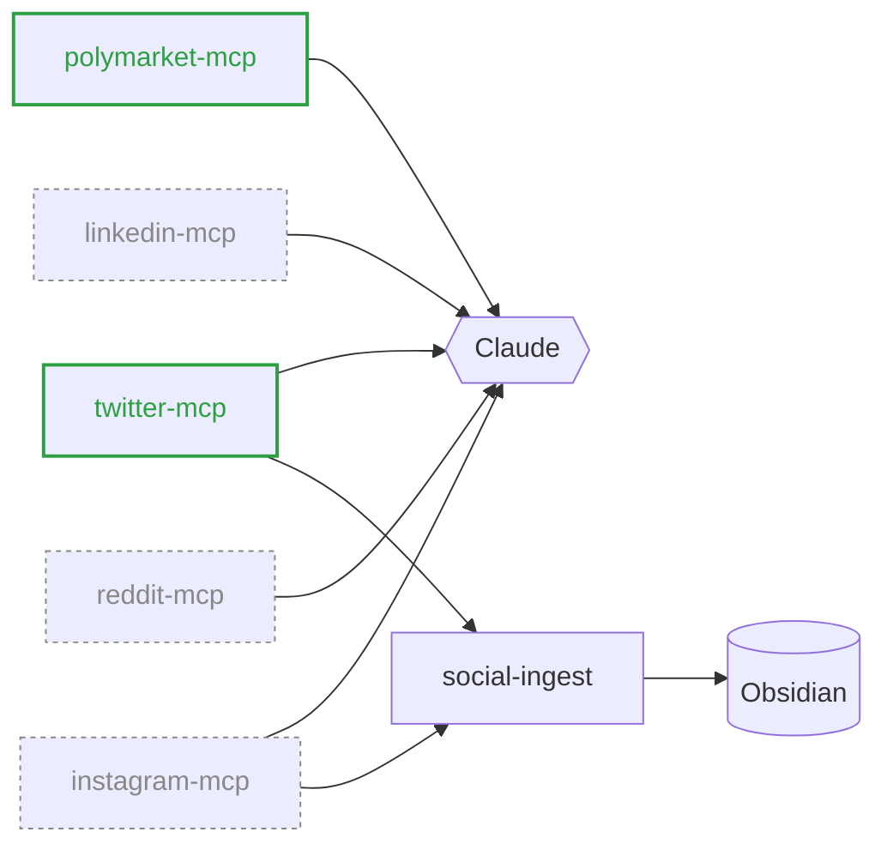

<h1 align="center">Juan Rodríguez</h1>

  <em>Read-only interfaces between the web and Claude.</em>

  Madrid · 2026

---

### What I'm building

### Public

- **[twitter-mcp](https://github.com/YoppaV/twitter-mcp)** — read-only Twitter/X for Claude. 17 tools, Playwright + GraphQL interception.
- **[polymarket-mcp](https://github.com/YoppaV/polymarket-mcp)** — Polymarket research MCP. 21 tools across 4 tiers: wallet forensics, market metadata, cross-wallet correlation.

### /now

Wiring agent workflows that read from social platforms and prediction markets, then route the interesting bits into a personal knowledge graph. Quietly figuring out which of these are worth open-sourcing next.

<code>Python</code> · <code>Playwright</code> · <code>FastMCP</code> · <code>TypeScript</code> · <code>Go</code> · <code>Postgres</code>
